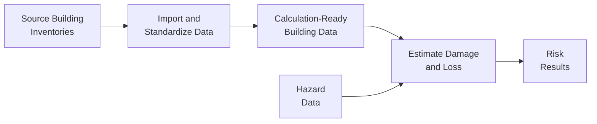
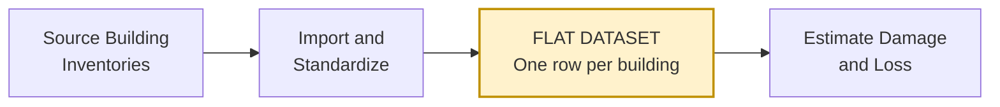
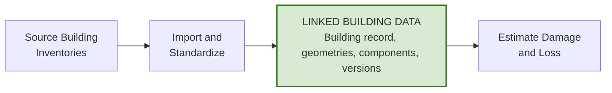
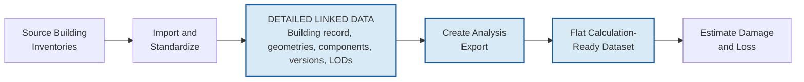
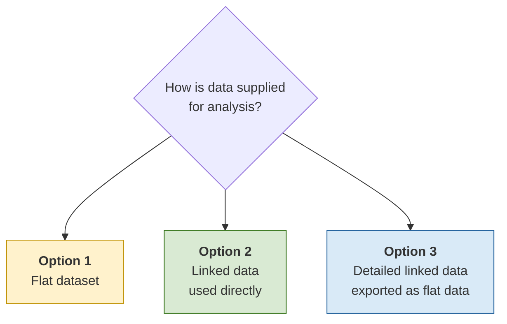

# RQM Building Data Model: Standards and Architecture Options

**Current focus:** Buildings  
**Purpose:** Compare high-level options for organizing building data used in Risk Quantification Methodology calculations.

## Background

Risk Quantification Methodology combines three types of information:

1. **Hazard:** The event or condition that may cause damage, such as flood depth.
2. **Exposure:** The buildings or other assets located in the affected area.
3. **Vulnerability:** The method used to estimate how an asset responds to the hazard.

Together, this information is used to estimate physical damage and financial loss.

## Current Baseline

The current workflow converts building inventories into standardized data used to estimate damage and loss.

### Workflow Explanation

1. **Source building inventories:** Records from national, local, commercial, or project-specific sources.
2. **Import and standardize data:** Check and convert source data into a consistent structure.
3. **Calculation-ready building data:** Building information prepared for analysis.
4. **Hazard data:** Information such as flood depth, velocity, duration, or uncertainty.
5. **Estimate damage and loss:** Combine building, hazard, and vulnerability information.
6. **Risk results:** Building-level or summarized damage, loss, and uncertainty results.

## Relevant Standards and Prior Work

| Reference                    | Current Role                   | Relevant Contribution                                             |
| ---------------------------- | ------------------------------ | ----------------------------------------------------------------- |
| FFRD data model              | Existing system architecture   | Model runs, hazard outputs, results, storage, and traceability    |
| National Structure Inventory | Current building-data baseline | Point locations, building attributes, and footprint references    |
| Inland Consequences          | Calculation workflow           | Inventory mapping, data checks, calculation inputs, and outputs   |
| Cloud Compute                | Model-execution framework      | Modular tools, data adapters, metadata, and workflow coordination |
| CityGML                      | Optional standards reference   | LOD, multiple representations, hierarchy, and extensibility       |

No single reference addresses every RQM requirement. The proposed architecture may reuse compatible concepts from several sources.

## Architecture Options

All options import and standardize source data. The difference is how building data is organized and supplied for analysis.

### Option 1: Single Flat Dataset

Maintain one flat dataset that is directly used to estimate damage and loss.

A flat dataset contains one row per building and columns for the selected geometry and attributes needed for analysis. The geometry may be a point, 2D footprint, or another supported form.

**Benefit:** Simple and similar to the current point-based workflow.

**Limitation:** Difficult to retain multiple geometry representations, components, and revisions for the same building.

### Option 2: Linked Data Tables

Maintain building information in separate, connected tables that are used directly for analysis.

Linked tables use identifiers to connect related information. i.e, one building record can connect to multiple geometry, component, or version records.

**Benefit:** Supports multiple geometries, levels of detail, components, inventory versions, and revisions.

**Limitation:** Analysis processes must be able to use the connected tables.

### Option 3: Detailed Linked Data with Calculation-Ready Exports

Maintain detailed, connected building information and generate a separate flat dataset for each analysis.

The analysis export is a separate flat dataset containing the information required for a specific analysis. The export may be created through ETL.

**Benefit:** Retains detailed building information while giving each analysis only the data it requires.

**Limitation:** Each export requires documented transformation, validation, and traceability rules.

Detailed linked data does not require every building to have detailed 3D geometry. It allows progressively richer information to be retained when available.

## Key Difference Between the Options

**i.e:** For one building, Option 1 keeps one selected geometry. Option 2 can retain both Microsoft and Oak Ridge National Laboratory footprints. Option 3 can retain both footprints and export only the selected geometry for a specific analysis.

## CityGML Concepts for Consideration

CityGML provides conceptual standard for representing city objects and their relationships. RQM can reuse selected principles without adopting the complete standard.

| CityGML Concept          | Possible RQM Value                                        |
| ------------------------ | --------------------------------------------------------- |
| LOD                      | Support progressively more detailed building geometry     |
| Multiple representations | Preserve alternative geometries for the same building     |
| Building hierarchy       | Connect buildings, building parts, floors, and components |
| Defined relationships    | Record what each geometry or component represents         |
| Validation               | Check that building components form a logical structure   |
| Extensibility            | Add RQM-specific or future hazard information             |
| Format independence      | Avoid dependence on one file or database format           |

CityGML defines four Levels of Detail (LOD):

- **LOD0:** Highly generalized representation
- **LOD1:** Basic block or extruded form
- **LOD2:** More realistic but generalized form
- **LOD3:** Highly detailed form

RQM may use these concepts without requiring strict CityGML compliance.

### Likely Overkill for Initial RQM Work

- Full CityGML compliance
- Textures and appearance information
- Interior rooms and furniture
- Complete city features
- Full topological modeling
- Every CityGML module
- Detailed 3D geometry for every building

### Applying CityGML Principles

Selected CityGML principles could strengthen Option 2 or Option 3 by supporting:

- Stable building records
- Alternative geometry representations
- Multiple LODs
- Building parts and relationships
- Source and revision history
- Validation of building structure

Therefore, CityGML warrants further consideration as a source of selected design principles, particularly for LOD, alternative geometries, building hierarchy, and validation. Full CityGML compliance is not recommended for the initial RQM architecture.

## Comparison Criteria

The options should be compared based on:

- Compatibility with existing FFRD workflows and the National Structure Inventory
- Support for point, 2D, 3D, and alternative geometries
- Support for building components, revisions, and inventory versions
- Traceability of sources, assumptions, and changes
- Ease of preparing calculation-ready data
- Implementation and maintenance effort
- Extensibility to other infrastructure and hazards

## Preliminary Findings

- Option 1 is simplest but provides the least flexibility.
- Option 2 supports connected geometry, component, inventory, and revision information.
- Option 3 retains detailed linked data while creating separate flat exports for analysis.
- Selected CityGML principles could strengthen Options 2 and 3 without requiring full compliance.
- The National Structure Inventory should remain an important compatibility baseline.
- The preferred option should support current analysis without adding features that have no demonstrated use.

## References

- [FFRD Data Model](https://github.com/fema-ffrd/ffrd-data-model)
- [FFRD Initial User Stories](https://github.com/fema-ffrd/ffrd-data-model/blob/main/docs/user-stories.md)
- [FFRD Validated User Stories](https://github.com/fema-ffrd/ffrd-data-model/blob/main/docs/user-stories-validated.md)
- [National Structure Inventory Technical Documentation](https://www.hec.usace.army.mil/confluence/nsi/technicalreferences/latest/technical-documentation)
- [Inland Consequences](https://github.com/fema-ffrd/inland-consequences)
- [CityGML Conceptual Model Standard](https://docs.ogc.org/is/20-010/20-010.html)
- FFRD Volume II Technical Standards and Procedures
- Cloud Compute Next Steps
